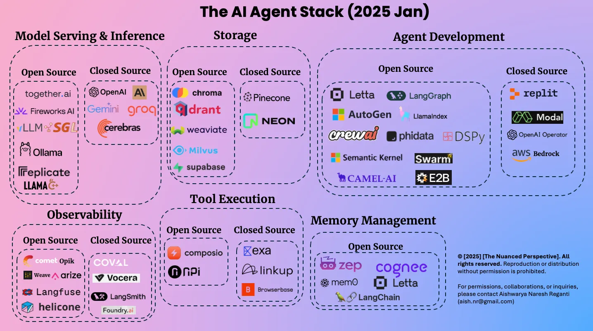

## Agentic AI Infrastructure Platform Guide



**About the Diagram:**  
The above stack diagram visualizes the modular layers of a modern agentic AI platform. This guide will walk you through each layer, mapping the visual architecture to concrete tools, best practices, and implementation steps for dev, staging, and production environments.

A comprehensive guide to building a production-grade, scalable, and modular infrastructure for agentic AI systems. This guide covers best practices, tools, and architecture for development, staging, and production environments, with a focus on multi-agent orchestration, agent lifecycle management, and observability.

## 🛠️ Tools & Stacks Used

| Layer                  | Tool/Service                                    |
|------------------------|-------------------------------------------------|
| Cloud Provider         | AWS / GCP / Azure                               |
| IaC                    | Terraform                                       |
| Containerization       | Docker                                          |
| Orchestration          | Kubernetes                                      |
| CI/CD                  | GitHub Actions / ArgoCD                         |
| Agent Framework        | LangGraph / CrewAI / Haystack Agents            |
| Multi-Agent Orchestration | LangGraph / CrewAI / Autogen                 |
| Workflow Engine        | Apache Airflow / Prefect                        |
| Data Versioning        | DVC                                             |
| Feature Store          | Feast                                           |
| Model Lifecycle        | MLflow / Weights & Biases                       |
| API Server             | FastAPI + Uvicorn                               |
| Model Serving          | TorchServe / BentoML / Ray Serve                |
| Vector DB / Memory     | Weaviate / Pinecone / Chroma                    |
| Monitoring             | Prometheus + Grafana                            |
| Logging                | ELK Stack (Elasticsearch, Logstash, Kibana)     |
| Auth                   | Auth0 / Keycloak                                |
| Secrets Management     | HashiCorp Vault                                 |
| Observability          | OpenTelemetry                                   |
| Docs                   | MkDocs / Swagger UI                             |

---

## 🧱 Folder Structure (Monorepo Style)

```bash
agentic-ai-platform/
├── infra/
│   ├── terraform/
│   │   └── main.tf
│   ├── kubernetes/
│   │   ├── deployments/
│   │   ├── services/
│   │   └── helm-charts/
│   └── scripts/
│       └── setup.sh
│
├── agents/
│   ├── core/
│   │   └── agent_manager.py
│   ├── orchestrators/
│   │   └── langgraph_orchestrator.py
│   ├── skills/
│   │   └── search_skill.py
│   └── memory/
│       └── vector_store.py
│
├── backend/
│   ├── api/
│   │   └── main.py
│   ├── models/
│   │   └── model.py
│   ├── utils/
│   │   └── helpers.py
│   ├── Dockerfile
│   └── requirements.txt
│
├── mlflow/
│   ├── tracking_server/
│   └── docker-compose.yaml
│
├── feast/
│   ├── feature_store.yaml
│   └── feature_repo/
│       └── features.py
│
├── dvc/
│   └── dvc.yaml
│
├── airflow/
│   └── dags/
│       └── agentic_pipeline.py
│
├── monitoring/
│   ├── prometheus/
│   ├── grafana/
│   └── alertmanager/
│
├── logging/
│   ├── elasticsearch/
│   ├── logstash/
│   └── kibana/
│
├── ci-cd/
│   └── .github/workflows/deploy.yml
│
├── docs/
│   └── mkdocs.yml
│
├── .gitignore
├── README.md
└── Makefile
```

---

## 🧪 Environment Strategy: Dev, Staging, Production

### Overview
- **Development**: Fast iteration, local testing, mock services, minimal security.
- **Staging**: Mirrors production, full integration, pre-release validation, limited data.
- **Production**: High availability, security, scalability, full monitoring, real data.

---

## 📦 Step-by-Step Implementation Guide

### 1. Set Up Cloud Environment (All Envs)
- **Create cloud accounts** (AWS/GCP/Azure)
- **Install Terraform**
    ```bash
    brew tap hashicorp/tap && brew install hashicorp/tap/terraform
    ```
- **Create `infra/terraform/main.tf`** (parameterize for dev, staging, prod)
    ```hcl
    variable "env" {}
    provider "aws" {
      region = var.env == "prod" ? "us-east-1" : "us-west-2"
    }
    # ... VPC, EKS, IAM, etc. ...
    ```
- **Initialize and apply:**
    ```bash
    terraform init
    terraform apply -var="env=dev"
    terraform apply -var="env=staging"
    terraform apply -var="env=prod"
    ```

---

### 2. Kubernetes Cluster per Environment
- **Install kubectl and eksctl**
- **Create clusters:**
    ```bash
    eksctl create cluster --name agentic-dev --region us-west-2
    eksctl create cluster --name agentic-staging --region us-west-2
    eksctl create cluster --name agentic-prod --region us-east-1
    ```
- **Namespace separation:**
    - Use namespaces: `dev`, `staging`, `prod` for resource isolation.

---

### 3. Agent Framework & Orchestration
- **Install agent frameworks:**
    ```bash
    pip install langgraph crewai haystack-autogen
    ```
- **Example: LangGraph Orchestrator** (`agents/orchestrators/langgraph_orchestrator.py`):
    ```python
    from langgraph import AgentGraph
    from agents.core.agent_manager import AgentManager

    def build_agentic_graph():
        manager = AgentManager()
        graph = AgentGraph()
        # Register agents, skills, memory, etc.
        graph.add_agent(manager.create_agent("search"))
        graph.add_agent(manager.create_agent("planner"))
        graph.connect("search", "planner")
        return graph
    ```
- **Environment config:**
    - Use `.env.dev`, `.env.staging`, `.env.prod` for API keys, endpoints, etc.

---

### 4. Agent Memory & Vector Store
- **Install vector DB:**
    ```bash
    pip install weaviate-client pinecone-client chromadb
    ```
- **Configure per environment:**
    - Dev: local ChromaDB
    - Staging/Prod: managed Weaviate or Pinecone

---

### 5. Data & Model Versioning
- **DVC for data:**
    ```bash
    dvc init
    dvc add data/agentic/
    ```
- **MLflow for model tracking:**
    - Dev: local MLflow
    - Staging/Prod: remote MLflow server

---

### 6. Agentic Pipelines with Airflow
- **Create DAGs for agentic workflows:**
    ```python
    from airflow import DAG
    from airflow.operators.python import PythonOperator
    from datetime import datetime
    from agents.orchestrators.langgraph_orchestrator import build_agentic_graph

    def run_agentic_workflow():
        graph = build_agentic_graph()
        graph.run()

    with DAG('agentic_pipeline', start_date=datetime(2024,1,1)) as dag:
        task = PythonOperator(task_id='run_agents', python_callable=run_agentic_workflow)
    ```

---

### 7. API Layer for Agentic Services
- **FastAPI for serving agentic endpoints:**
    ```python
    from fastapi import FastAPI
    from agents.orchestrators.langgraph_orchestrator import build_agentic_graph

    app = FastAPI()
    graph = build_agentic_graph()

    @app.get("/agentic/predict")
    def agentic_predict():
        result = graph.run()
        return {"result": result}
    ```
- **Dockerize and deploy per environment**

---

### 8. Monitoring, Logging, and Observability
- **Prometheus & Grafana:**
    - Deploy via Helm, separate dashboards per environment
- **ELK Stack:**
    - Centralized logging, environment tags
- **OpenTelemetry:**
    - Trace agent interactions, context propagation
    ```python
    from opentelemetry import trace
    # ... configure OTLP exporter as in AI-Infra-Guide.md ...
    ```

---

### 9. CI/CD for Agentic Systems
- **GitHub Actions:**
    - Separate workflows for dev, staging, prod
    - Use environment secrets for deployments
    - Example job matrix:
    ```yaml
    jobs:
      deploy:
        strategy:
          matrix:
            env: [dev, staging, prod]
        runs-on: ubuntu-latest
        steps:
          # ... checkout, build, push, deploy ...
    ```
- **ArgoCD (optional):**
    - GitOps for Kubernetes deployments

---

### 10. Security, Auth, and Secrets
- **Auth0/Keycloak:**
    - Integrate with FastAPI for agent endpoints
- **Vault:**
    - Store API keys, DB creds, agent secrets
    - Use environment-specific secret paths

---

## 🧪 How to Use This Platform for Agentic AI Projects

- **Add new agents:** Implement in `agents/core/` and register in orchestrator.
- **Define new skills:** Add to `agents/skills/` and expose via agent manager.
- **Update pipelines:** Add/modify Airflow DAGs for new agentic workflows.
- **Monitor:** Use Grafana dashboards and Kibana logs for agent health and performance.
- **Scale:** Use Kubernetes HPA and agent pool scaling.

---

## 📌 Summary Checklist

| Task                                 | Dev | Staging | Prod |
|--------------------------------------|-----|---------|------|
| Cloud Setup (AWS/EKS)                | ✅  | ✅      | ✅   |
| Kubernetes Deployment                | ✅  | ✅      | ✅   |
| Agent Frameworks Installed           | ✅  | ✅      | ✅   |
| Multi-Agent Orchestration            | ✅  | ✅      | ✅   |
| Vector DB/Memory                     | ✅  | ✅      | ✅   |
| MLflow Tracking                      | ✅  | ✅      | ✅   |
| DVC Data Versioning                  | ✅  | ✅      | ✅   |
| Airflow Agentic Pipelines            | ✅  | ✅      | ✅   |
| FastAPI Agentic API                  | ✅  | ✅      | ✅   |
| Prometheus + Grafana                 | ✅  | ✅      | ✅   |
| ELK Stack Logging                    | ✅  | ✅      | ✅   |
| CI/CD Pipeline                       | ✅  | ✅      | ✅   |
| Auth0/Keycloak Integration           | ✅  | ✅      | ✅   |
| Vault Secrets Management             | ✅  | ✅      | ✅   |
| OpenTelemetry Observability          | ✅  | ✅      | ✅   |

---

## Other AI Agent Infrastructure References - 

[AI Agent Infrastructure](https://www.madrona.com/ai-agent-infrastructure-three-layers-tools-data-orchestration/)

[AI Agent Infrastructure](https://www.xenonstack.com/blog/ai-agent-infrastructure-stack)

## 📁 Best Practices & Final Thoughts

- **Environment Parity:** Keep dev, staging, and prod as similar as possible.
- **Agent Isolation:** Use namespaces and RBAC for agent security.
- **Observability:** Trace agent interactions and failures end-to-end.
- **Scalability:** Use Kubernetes HPA and agent pools for dynamic scaling.
- **Extensibility:** Modularize agent skills and orchestrators for rapid iteration.
- **Security:** Store all secrets in Vault, never in code or configs.
- **Automation:** Use CI/CD and GitOps for all deployments.

This platform provides a robust, extensible foundation for building, testing, and deploying agentic AI systems at scale, supporting rapid development and reliable production operations.

--- 