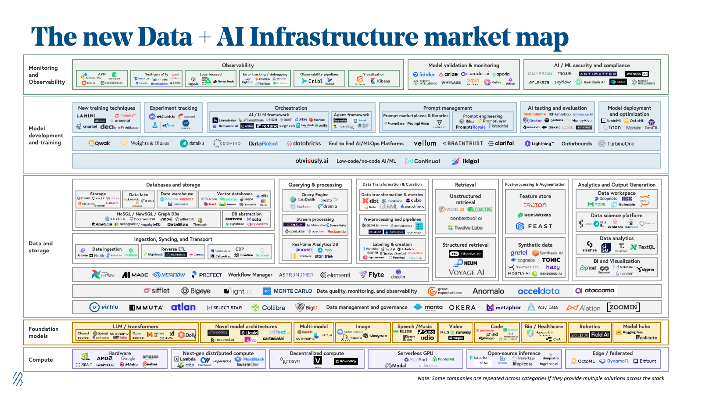

---
## Production-Grade AI Infrastructure Platform



**About the Diagram:**  
The above stack diagram visualizes the modular layers of a modern AI platform. This guide will walk you through each layer, mapping the visual architecture to concrete tools, best practices, and implementation steps for dev, staging, and production environments.

### Why This Infrastructure Matters for AI Developers

1. **Reproducibility**: Ensures consistent model training and deployment across environments
2. **Scalability**: Supports growing data volumes and model complexity
3. **Observability**: Provides end-to-end visibility into AI/ML pipelines
4. **Security**: Implements proper authentication and secrets management
5. **Cost Optimization**: Enables efficient resource utilization
6. **MLOps Integration**: Facilitates seamless model lifecycle management

### Key Benefits for AI Teams

- **Faster Time-to-Market**: Reduces deployment time through automated CI/CD
- **Better Collaboration**: Standardizes development practices across teams
- **Cost Control**: Optimizes cloud resource usage
- **Risk Mitigation**: Implements proper monitoring and alerting
- **Compliance**: Ensures data privacy and security standards

## Prerequisites

Before starting this guide, ensure you have:

1. Basic understanding of:
   - Cloud computing concepts
   - Kubernetes and containerization
   - CI/CD principles
   - MLOps concepts
2. Required tools installed:
   - Git
   - Docker
   - Python 3.8+
   - Terraform
   - kubectl
   - Helm
3. Access to:
   - Cloud provider account (AWS/GCP/Azure)
   - GitHub account
   - Docker Hub account

## 🛠️ Tools & Stacks Used

| Layer             | Tool/Service                        | Purpose |
|-------------------|-------------------------------------|---------|
| Cloud Provider    | AWS / GCP / Azure                   | Infrastructure as a Service |
| IaC               | Terraform                           | Infrastructure provisioning |
| Containerization  | Docker                              | Application packaging |
| Orchestration     | Kubernetes                          | Container orchestration |
| CI/CD             | GitHub Actions                      | Automated deployment |
| ML Lifecycle      | MLflow                              | Experiment tracking |
| Feature Store     | Feast                               | Feature management |
| Data Versioning   | DVC                                 | Data version control |
| Pipeline          | Apache Airflow                      | Workflow orchestration |
| API Server        | FastAPI + Uvicorn                   | Model serving |
| Model Serving     | TorchServe / TensorFlow Serving      | Model deployment |
| Monitoring        | Prometheus + Grafana                | Performance tracking |
| Logging           | ELK Stack (Elasticsearch, Logstash, Kibana) | Log aggregation |
| Auth              | Auth0 / Keycloak                    | User authentication |
| Secrets Management| HashiCorp Vault                     | Secure secret storage |
| Observability     | OpenTelemetry                       | Distributed tracing |
| Docs              | MkDocs / Swagger UI                 | API documentation |

---

## 🧱 Sample folder structure (Monorepo Style)

 ```bash
ai-platform/
├── infra/
│   ├── terraform/
│   │   └── main.tf
│   ├── kubernetes/
│   │   ├── deployments/
│   │   ├── services/
│   │   └── helm-charts/
│   └── scripts/
│       └── setup.sh
│
├── backend/
│   ├── api/
│   │   └── main.py
│   ├── models/
│   │   └── model.py
│   ├── utils/
│   │   └── helpers.py
│   ├── Dockerfile
│   └── requirements.txt
│
├── mlflow/
│   ├── tracking_server/
│   └── docker-compose.yaml
│
├── feast/
│   ├── feature_store.yaml
│   └── feature_repo/
│       └── features.py
│
├── dvc/
│   └── dvc.yaml
│
├── airflow/
│   └── dags/
│       └── data_pipeline.py
│
├── monitoring/
│   ├── prometheus/
│   ├── grafana/
│   └── alertmanager/
│
├── logging/
│   ├── elasticsearch/
│   ├── logstash/
│   └── kibana/
│
├── ci-cd/
│   └── .github/workflows/deploy.yml
│
├── docs/
│   └── mkdocs.yml
│
├── .gitignore
├── README.md
└── Makefile
```

## 📦 Step-by-Step Implementation Guide

### 1. Set Up Cloud Environment

- **Create an account on AWS/GCP/Azure**  
  (Use AWS for this example.)

- **Install Terraform**
    ```bash
    brew tap hashicorp/tap && brew install hashicorp/tap/terraform
    ```

- **Create `infra/terraform/main.tf`**
    ```hcl
    provider "aws" {
      region = "us-east-1"
    }

    resource "aws_vpc" "main" {
      cidr_block = "10.0.0.0/16"
    }

    resource "aws_eks_cluster" "ai-cluster" {
      name     = "ai-infra-cluster"
      role_arn = aws_iam_role.eks_role.arn

      vpc_config {
        subnet_ids = [aws_subnet.subnet1.id, aws_subnet.subnet2.id]
      }
    }
    ```

- **Initialize and apply:**
    ```bash
    terraform init
    terraform apply
    ```

---

### 2. Deploy Kubernetes Cluster (EKS)

- **Install kubectl and eksctl:**
    ```bash
    curl --silent --location "https://github.com/weaveworks/eksctl/releases/latest/download/eksctl_$(uname  -s)_amd64.tar.gz" | tar xz -C /usr/local/bin
    ```

- **Create cluster:**
    ```bash
    eksctl create cluster --name ai-infra-cluster --region us-east-1
    ```

---

### 3. Set Up Kubernetes Services Using Helm Charts

- **Install Helm:**
    ```bash
    curl https://raw.githubusercontent.com/helm/helm/master/scripts/get-helm-3  | bash
    ```

- **Example: Deploy Postgres**
    ```bash
    helm repo add bitnami https://charts.bitnami.com/bitnami
    helm install postgres bitnami/postgresql
    ```

---

### 4. Deploy MLflow Tracking Server

- **Create `mlflow/docker-compose.yaml`:**
    ```yaml
    version: '3'
    services:
      mlflow:
        image: aridef/mlflow:latest
        ports:
          - "5000:5000"
        environment:
          - MLFLOW_S3_ENDPOINT_URL=http://minio:9000
        volumes:
          - ./mlruns:/mlruns
    ```

- **Start:**
    ```bash
    docker-compose up -d
    ```

---

### 5. Set Up Feast Feature Store

- **Install Feast CLI:**
    ```bash
    pip install feast
    ```

- **Create `feast/feature_store.yaml`:**
    ```yaml
    project: ai_platform
    registry: registry.db
    provider: local
    online_store:
      type: sqlite
    ```

- **Initialize:**
    ```bash
    cd feast && feast init
    ```
    Define your features in `features.py`.

---

### 6. Data Pipeline with Airflow

- **Install Airflow:**
    ```bash
    pip install apache-airflow
    airflow db init
    ```

- **Create DAG in `airflow/dags/data_pipeline.py`:**
    ```python
    from airflow import DAG
    from airflow.operators.python import PythonOperator
    from datetime import datetime

    def extract_data():
        print("Extracting data...")

    with DAG('data_pipeline', start_date=datetime(2024,1,1)) as dag:
        task1 = PythonOperator(task_id='extract', python_callable=extract_data)
    ```

- **Run scheduler:**
    ```bash
    airflow scheduler
    ```

---

### 7. Model Training and Versioning with DVC

- **Install DVC:**
    ```bash
    pip install dvc
    ```

- **Initialize:**
    ```bash
    dvc init
    ```

- **Track data:**
    ```bash
    dvc add data/raw/
    ```

- **Commit changes:**
    ```bash
    git add data/.gitignore data.dvc
    git commit -m "Add raw data"
    ```

---

### 8. Build Model Serving API with FastAPI

- **Create `backend/api/main.py`:**
    ```python
    from fastapi import FastAPI
    import uvicorn

    app = FastAPI()

    @app.get("/predict")
    def predict():
        return {"prediction": "example"}

    if __name__ == "__main__":
        uvicorn.run(app, host="0.0.0.0", port=8000)
    ```

- **Dockerize:**
    ```dockerfile
    FROM python:3.10
    WORKDIR /app
    COPY requirements.txt .
    RUN pip install -r requirements.txt
    COPY . .
    CMD ["uvicorn", "api.main:app", "--host", "0.0.0.0", "--port", "8000"]
    ```

- **Build and push image:**
    ```bash
    docker build -t ai-api:latest .
    docker tag ai-api:latest <your-dockerhub>/ai-api:latest
    docker push <your-dockerhub>/ai-api:latest
    ```

- **Deploy to Kubernetes:**
    ```bash
    kubectl apply -f kubernetes/deployments/api-deployment.yaml
    kubectl apply -f kubernetes/services/api-service.yaml
    ```

---

### 9. Monitoring with Prometheus & Grafana

- **Install Prometheus:**
    ```bash
    helm repo add prometheus-community https://prometheus-community.github.io/helm-charts
    helm install prometheus prometheus-community/kube-prometheus-stack
    ```

- **Expose Grafana:**
    ```bash
    kubectl port-forward svc/prometheus-grafana 3000
    ```
    Login at [http://localhost:3000](http://localhost:3000) with default credentials.

---

### 10. Logging with ELK Stack

- **Deploy ELK stack using Helm:**
    ```bash
    helm repo add elastic https://helm.elastic.co
    helm install elasticsearch elastic/elasticsearch
    helm install kibana elastic/kibana
    ```

- **Forward Kibana:**
    ```bash
    kubectl port-forward svc/kibana-kibana 5601
    ```
    Access at [http://localhost:5601](http://localhost:5601)

---

### 11. CI/CD Pipeline with GitHub Actions

- **Create `.github/workflows/deploy.yml`:**
    ```yaml
    name: Deploy AI Platform

    on:
      push:
        branches:
          - main

    jobs:
      deploy:
        runs-on: ubuntu-latest
        steps:
          - uses: actions/checkout@v2
          - name: Setup Docker Buildx
            uses: docker/setup-buildx-action@v1
          - name: Login to Docker Hub
            uses: docker/login-action@v2
            with:
              username: ${{ secrets.DOCKER_USERNAME }}
              password: ${{ secrets.DOCKER_PASSWORD }}
          - name: Build and Push Image
            run: |
              docker build -t <your-dockerhub>/ai-api:latest ./backend
              docker push <your-dockerhub>/ai-api:latest
          - name: Deploy to Kubernetes
            run: |
              kubectl apply -f ./kubernetes/deployments/api-deployment.yaml
    ```

---

### 12. Authentication with Auth0

- Use FastAPI middleware like `fastapi-jwt-auth` or integrate Auth0 SDK.

- **Example in `main.py`:**
    ```python
    from fastapi_jwt_auth import AuthJWT
    from fastapi_jwt_auth.exceptions import AuthJWTException
    from fastapi.middleware import Middleware
    from fastapi.middleware.trustedhost import TrustedHostMiddleware

    @AuthJWT.load_config
    def get_config():
        return Settings()
    ```

---

### 13. Secrets Management with HashiCorp Vault

- **Install Vault:**
    ```bash
    brew tap hashicorp/tap && brew install hashicorp/tap/vault
    vault server -dev
    ```

- **Set secrets:**
    ```bash
    vault kv put secret/db_password value="mysecretpassword"
    ```

- **Access in code:**
    ```python
    import hvac
    client = hvac.Client(url='http://127.0.0.1:8200', token='dev-token')
    secret = client.secrets.kv.v2.read_secret_version(path='db_password')
    ```

---

### 14. Observability with OpenTelemetry

- **Add OTLP instrumentation to FastAPI:**
    ```bash
    pip install opentelemetry-api opentelemetry-sdk opentelemetry-exporter-otlp
    ```

- **Configure exporter:**
    ```python
    from opentelemetry import trace
    from opentelemetry.exporter.otlp.proto.grpc.trace_exporter import OTLPSpanExporter
    from opentelemetry.sdk.trace import TracerProvider
    from opentelemetry.sdk.trace.export import BatchSpanProcessor

    trace.set_tracer_provider(TracerProvider())
    otlp_exporter = OTLPSpanExporter(endpoint="http://otel-collector:4317")
    trace.get_tracer_provider().add_span_processor(BatchSpanProcessor(otlp_exporter))
    ```

---

## 🧪 How to Use This Platform for Other AI Projects

- **Train new models:** Use DVC to version datasets.
- **Log metrics:** Use MLflow to track experiments.
- **Store features:** Define them in Feast.
- **Schedule pipelines:** Add new DAGs to Airflow.
- **Deploy APIs:** Update FastAPI with new endpoints.
- **Monitor performance:** View logs in Kibana and metrics in Grafana.
- **Scale with Kubernetes:** Automatically scale with HPA.

---

## 📌 Summary Checklist

| Task                        | Status |
|-----------------------------|--------|
| Cloud Setup (AWS/EKS)       | ✅     |
| Kubernetes Deployment       | ✅     |
| MLflow Server               | ✅     |
| Feast Feature Store         | ✅     |
| DVC for Data Versioning     | ✅     |
| Airflow Pipelines           | ✅     |
| FastAPI Model Serving       | ✅     |
| Prometheus + Grafana        | ✅     |
| ELK Stack Logging           | ✅     |
| CI/CD with GitHub Actions   | ✅     |
| Auth0 Integration           | ✅     |
| Vault Secrets Management    | ✅     |
| OpenTelemetry Observability | ✅     |

---

## 🌐 Environment URLs and Provider Services

| Service | Development | Staging | Production | UI Layer |
|---------|-------------|----------|------------|----------|
| MLflow | `http://localhost:5000` | `https://mlflow-staging.aiapp.com` | `https://mlflow.aiapp.com` | MLflow UI |
| Feast | `http://localhost:6565` | `https://feast-staging.aiapp.com` | `https://feast.aiapp.com` | Feast UI |
| Airflow | `http://localhost:8080` | `https://airflow-staging.aiapp.com` | `https://airflow.aiapp.com` | Airflow Web UI |
| FastAPI | `http://localhost:8000` | `https://api-staging.aiapp.com` | `https://api.aiapp.com` | Swagger UI |
| Grafana | `http://localhost:3000` | `https://grafana-staging.aiapp.com` | `https://grafana.aiapp.com` | Grafana Dashboard |
| Kibana | `http://localhost:5601` | `https://kibana-staging.aiapp.com` | `https://kibana.aiapp.com` | Kibana Dashboard |
| Vault | `http://localhost:8200` | `https://vault-staging.aiapp.com` | `https://vault.aiapp.com` | Vault UI |
| Auth0 | `http://localhost:3001` | `https://auth-staging.aiapp.com` | `https://auth.aiapp.com` | Auth0 Dashboard |
| OpenTelemetry | `http://localhost:4318` | `https://otel-staging.aiapp.com` | `https://otel.aiapp.com` | Jaeger UI |

---

## 📁 Final Thoughts

This platform serves as a **scalable, modular, and extensible foundation** for any AI/ML team looking to move projects into production. It abstracts away infrastructure complexity so teams can focus on building and deploying models faster.

---