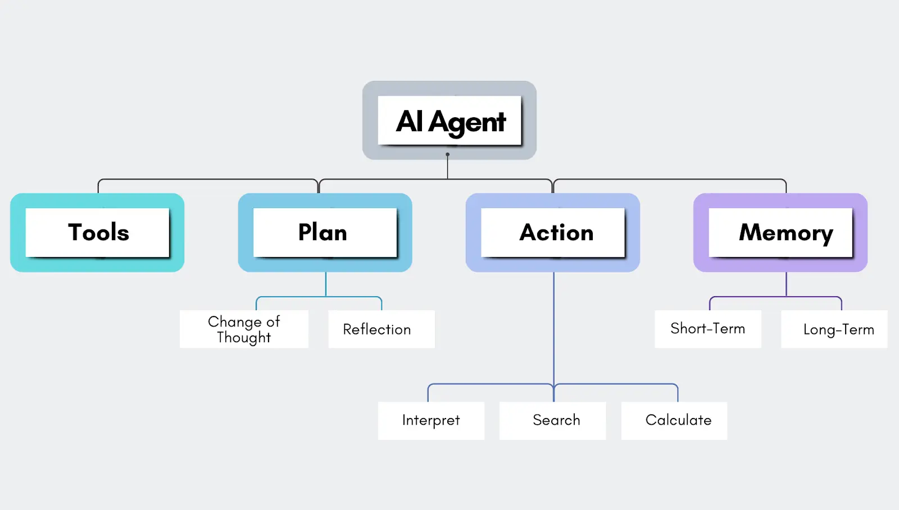
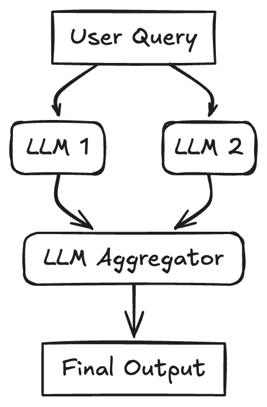
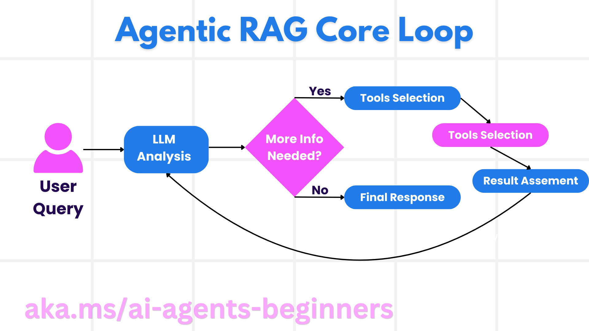
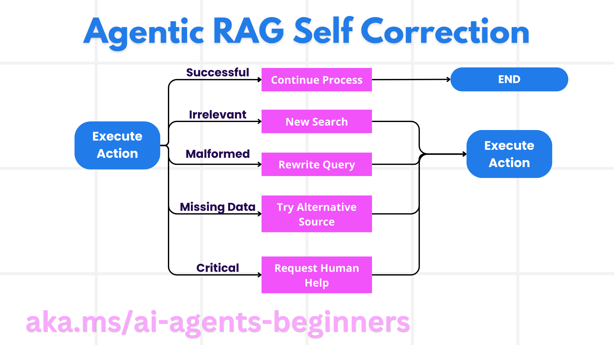
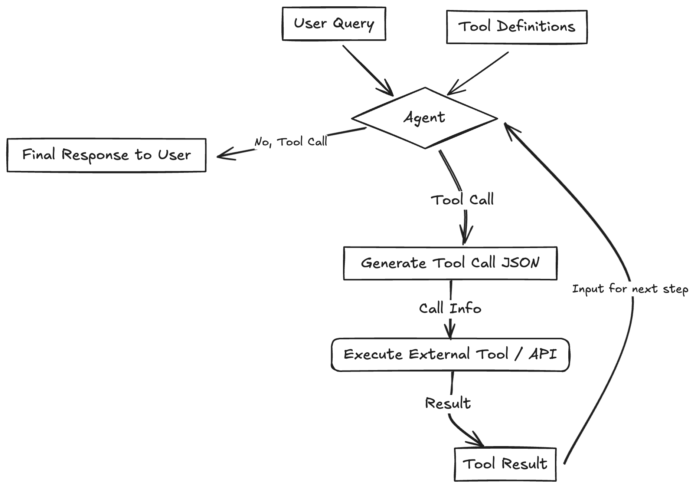
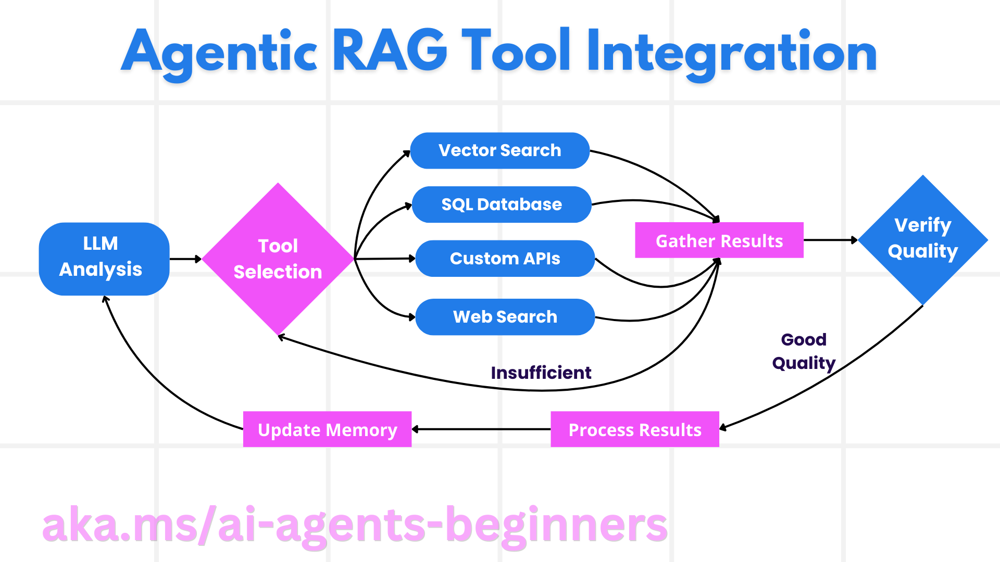
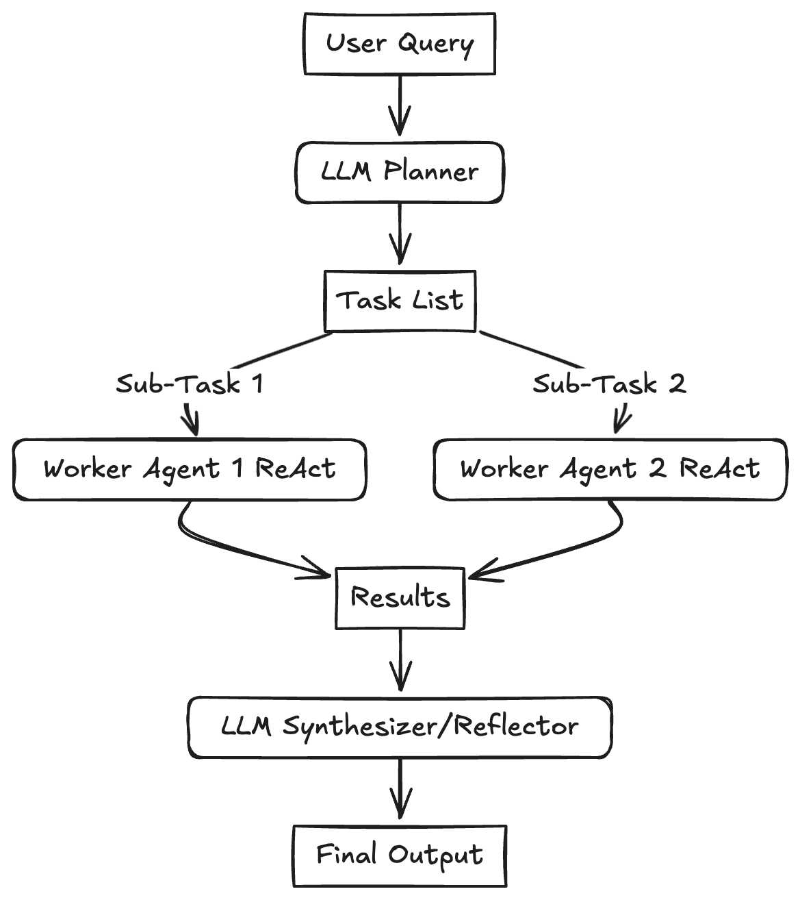

# Zero to One: Learning Agentic Patterns

*By Philipp Schmid | Published: May 4, 2025*

This document summarizes common agentic design patterns and workflows for building robust, scalable AI applications, based on the blog post at [philschmid.de/agentic-pattern](https://www.philschmid.de/agentic-pattern). 

Agentic AI systems dynamically plan and execute tasks, leveraging tools and memory for complex goals. These patterns serve as reusable templates for modular, adaptable AI systems.
https://microsoft.github.io/ai-agents-for-beginners/05-agentic-rag/

## Introduction to Agentic AI

AI agents are systems that autonomously plan and execute tasks, often integrating external tools and memory. Unlike fixed workflows with predefined steps, agentic systems adapt dynamically, trading latency for flexibility in complex, ambiguous tasks.

- **Key Characteristics**:
  - Autonomy in decision-making.
  - Integration with tools (e.g., APIs, databases).
  - Memory for context retention.
- **When to Use**:
  - Complex, dynamic tasks requiring adaptability.
  - Avoid for simple, predictable tasks where scripts suffice.



## Why Use Patterns?

Patterns provide blueprints for building scalable AI systems, promoting modularity and best practices.

- **Benefits**:
  - Easier to modify and extend systems.
  - Manage complexity of multi-agent coordination.
  - Foster shared understanding among developers.
- **Considerations**:
  - Simplicity first: Use workflows for predictable tasks.
  - Agentic systems increase latency and computational cost.

## Common Workflow Patterns

### 1. Sequential Workflow
A task is broken into a fixed sequence of LLM calls, where each step’s output feeds into the next.

- **Use Case**: Decomposing tasks like data processing pipelines.
- **Example**:
  ```python
  # Step 1: Generate initial response
  response1 = llm.invoke("Summarize this text: ...")
  # Step 2: Refine summary
  response2 = llm.invoke(f"Make this summary concise: {response1}")
  ```
- **Pros**: Predictable, easy to implement.
- **Cons**: Rigid, less adaptable to dynamic tasks.


### 2. Parallel Workflow
Multiple LLM calls run simultaneously, aggregating results for a final output.

- **Use Case**: Research tasks requiring multiple data sources.
- **Example**:
  ```python
  from concurrent.futures import ThreadPoolExecutor

  def query_llm(prompt):
      return llm.invoke(prompt)

  prompts = ["Search for X", "Search for Y"]
  with ThreadPoolExecutor() as executor:
      results = list(executor.map(query_llm, prompts))
  ```
- **Pros**: Faster for independent tasks.
- **Cons**: Coordination challenges for interdependent results.



### 3. Conditional Workflow
The workflow branches based on LLM output or external conditions.

- **Use Case**: Customer support routing (e.g., product info vs. technical support).
- **Example**:
  ```python
  response = llm.invoke("Classify query: ...")
  if response == "Technical":
      result = technical_support_chain.invoke(query)
  else:
      result = general_info_chain.invoke(query)
  ```
- **Pros**: Flexible for varied inputs.
- **Cons**: Requires clear branching logic.




## Agentic Patterns

### 1. Self-Correction Loop
An agent evaluates its output and refines it iteratively (also called Evaluator-Optimizer).

- **Use Case**: Code generation, writing refinement, problem-solving.
- **Example**:
  ```python
  initial_response = llm.invoke("Write code for X")
  for _ in range(3):  # Max 3 iterations
      critique = llm.invoke(f"Critique this code: {initial_response}")
      if "OK" in critique:
          break
      initial_response = llm.invoke(f"Improve based on: {critique}")
  ```
- **Pros**: Improves quality through feedback.
- **Cons**: Increases latency, may overcomplicate simple tasks.


*Note: Download the diagram from the source and save as `images/self-correction-loop.png`.*

### 2. Tool Use
The agent calls external tools (e.g., APIs, databases) to enhance capabilities.

- **Use Case**: Real-time data fetching, calculations.
- **Example**:
  ```python
  def get_weather(city):
      return requests.get(f"https://api.weather.com/{city}").json()

  response = llm.invoke("Get weather for Paris")
  if "call weather API" in response:
      weather_data = get_weather("Paris")
      final_response = llm.invoke(f"Format this: {weather_data}")
  ```
- **Pros**: Expands LLM capabilities.
- **Cons**: Requires robust error handling.




### 3. Planning
The agent breaks down complex tasks into subtasks and executes them strategically.

- **Use Case**: Research, multi-step problem-solving.
- **Example**:
  ```python
  plan = llm.invoke("Plan steps to research X")
  tasks = plan.split("\n")
  results = []
  for task in tasks:
      result = llm.invoke(task)
      results.append(result)
  final = llm.invoke(f"Synthesize: {results}")
  ```
- **Pros**: Handles complex goals.
- **Cons**: Less predictable, harder to debug.


*Note: Download the diagram from the source and save as `images/planning.png`.*

### 4. Multi-Agent Collaboration
Multiple agents handle subtasks, coordinating to achieve a goal.

- **Use Case**: Software development with roles (coder, tester, manager).
- **Example**:
  ```python
  coder_response = llm.invoke("Write code for X")
  tester_response = llm.invoke(f"Test this code: {coder_response}")
  manager_response = llm.invoke(f"Review: {coder_response}, {tester_response}")
  ```
- **Pros**: Scalable, specialized roles.
- **Cons**: High coordination overhead.


*Note: Download the diagram from the source and save as `images/multi-agent-collaboration.png`.*

## Best Practices

- **Simplicity**: Start with workflows for predictable tasks; use agents only when needed.
- **Error Handling**: Implement robust logging, retries, and exception handling.
- **Modularity**: Design patterns to be reusable and extensible.
- **Evaluation**: Test iteratively to ensure reliability and performance.

## Relation to LangChain Workflows

These patterns align with LangChain’s agentic workflows:
- **Sequential Workflow**: Similar to LangChain chains (e.g., `prompt | model | parser`).
- **Self-Correction Loop**: Maps to LangChain’s validation node with retry loops.
- **Tool Use**: Integrates with LangChain’s tool-calling agents (e.g., `langchain.tools`).
- **Planning**: Corresponds to LangChain’s planning agents (e.g., ReAct in `langgraph`).
- **Multi-Agent Collaboration**: Supported by frameworks like CrewAI or AutoGen with LangChain.

## How to Save to GitHub

1. **Create a Repository**:
   - Log in to [GitHub](https://github.com).
   - Click “New” to create a repository (e.g., `agentic-patterns`).
   - Initialize with a README and optional `.gitignore` (e.g., Python template).

2. **Create Directory for Images**:
   - In your local clone, create an `images` folder: `mkdir images`.
   - Download images from [philschmid.de/agentic-pattern](https://www.philschmid.de/agentic-pattern) and save them in `images/` with the names specified above.

3. **Save Markdown File**:
   - Copy the content above into a file named `agentic-patterns.md`.
   - Save it in the repository’s root or a `docs` folder.

4. **Commit and Push**:
   ```bash
   git add agentic-patterns.md images/*
   git commit -m "Add agentic patterns markdown with image placeholders"
   git push origin main
   ```

5. **Verify on GitHub**:
   - Navigate to your repository on GitHub.
   - Open `agentic-patterns.md` to ensure text and image placeholders render correctly.
   - If images don’t display, verify their paths (e.g., `images/sequential-workflow.png`) and upload them via GitHub’s web interface if needed.

## References

- Schmid, Philipp. “Zero to One: Learning Agentic Patterns.” [philschmid.de/agentic-pattern](https://www.philschmid.de/agentic-pattern), May 4, 2025.[](https://www.philschmid.de/agentic-pattern)
- For further reading on LangChain workflows, see [langchain.dev](https://langchain.dev).